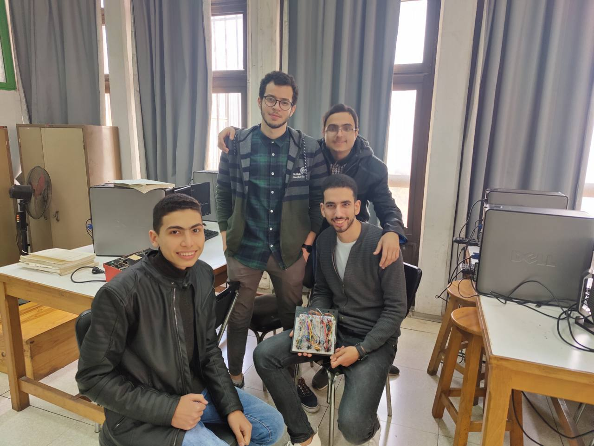
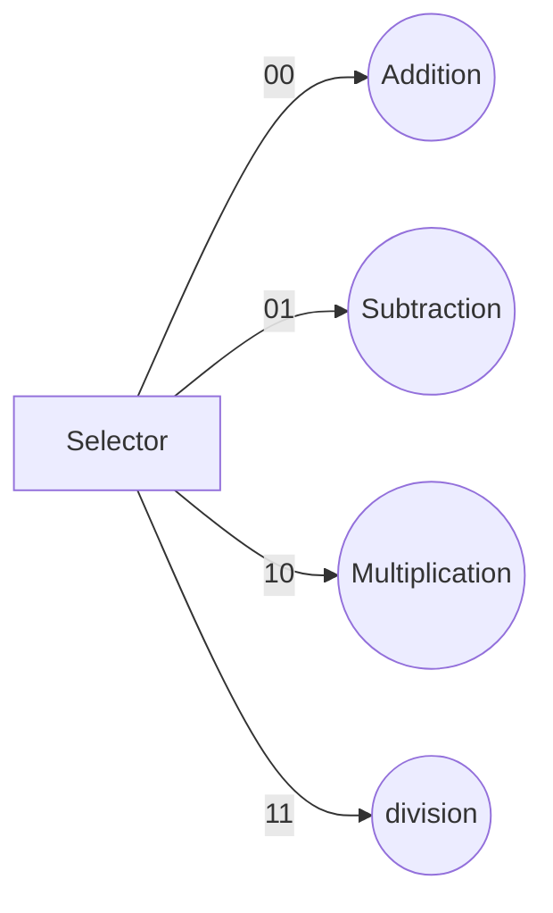
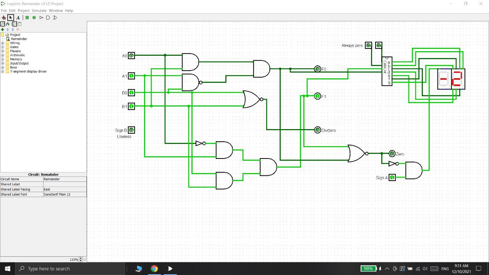
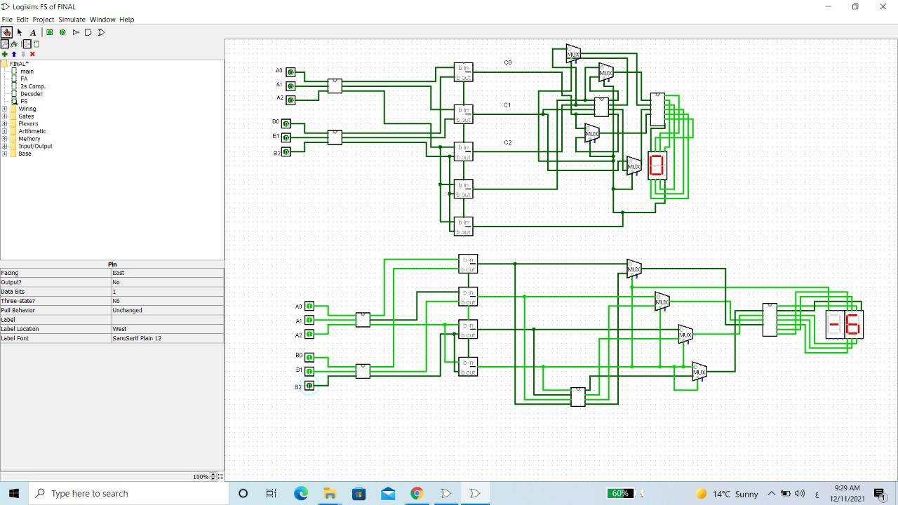
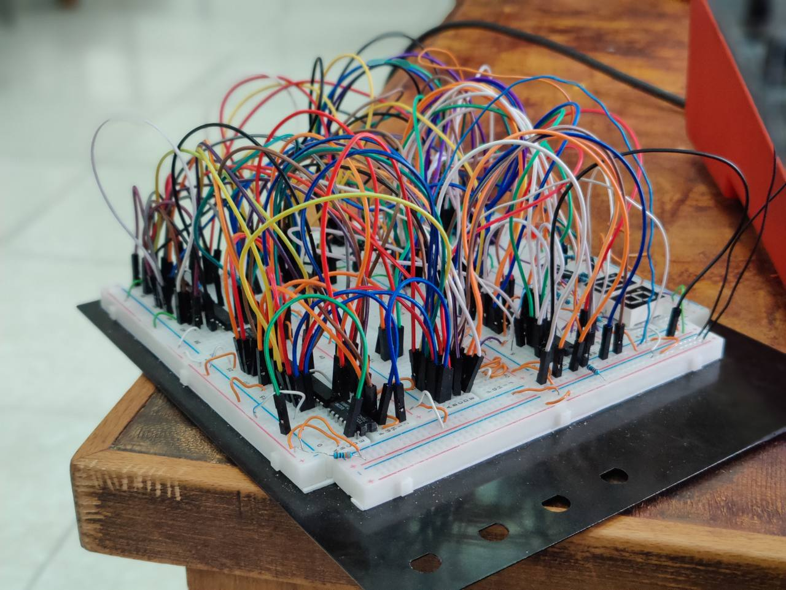
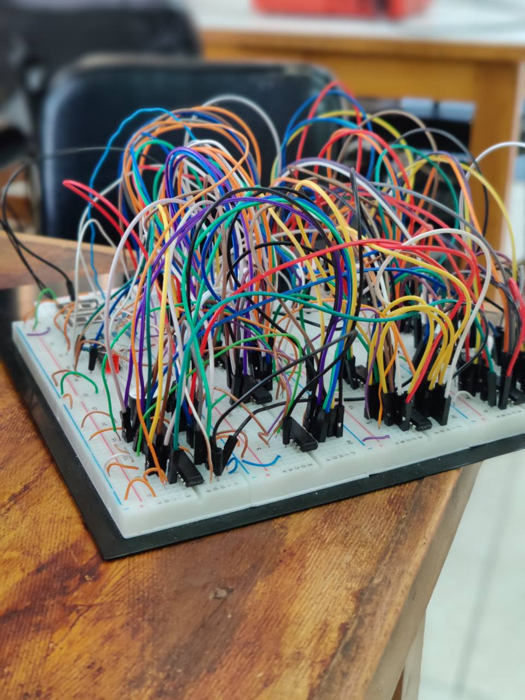
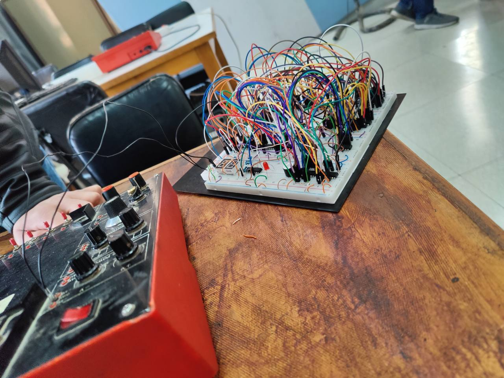

> Alone we can do so little; together we can do so much.
# Arithmetic-Logic-Unit

A project for the logic design of making a calculator using logic gates on the emulator and then converting it to hardware.

# Files
```sh
Info.txt -> Information about the team members involved in the project
Calc.circ -> This file contains the entire project
buzzer.jar -> Library to play a beep sound when dividing by zero
```


## UML diagrams

This flow chart is used to express how to choose the correct operation to perform



## Images

### Some Images during the implementation of the software




<hr/>

### Photos of the final product that was evaluated by the supervisor in the final grade and the best project in the semester
<div align="center">




<div/>

<div align="left">

## Team Members:

 - Yousef Mohamed El-Said Rabia
 - Yousef Mohamed Hajjaj
 - Mahmoud Sobhy Rashid
 - Mahmoud Yahya Shawky
 <div/>
